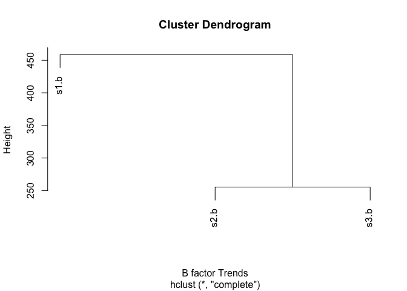

HW06
================
Jaya George
4/18/2019

Original Code
-------------

``` r
library(bio3d)

s1 <- read.pdb("4AKE") # kinase with drug
```

    ##   Note: Accessing on-line PDB file

``` r
s2 <- read.pdb("1AKE") # kinase no drug
```

    ##   Note: Accessing on-line PDB file
    ##    PDB has ALT records, taking A only, rm.alt=TRUE

``` r
s3 <- read.pdb("1E4Y") # kinase with drug
```

    ##   Note: Accessing on-line PDB file

``` r
s1.chainA <- trim.pdb(s1, chain="A", elety="CA")
s2.chainA <- trim.pdb(s2, chain="A", elety="CA")
s3.chainA <- trim.pdb(s3, chain="A", elety="CA")

s1.b <- s1.chainA$atom$b
s2.b <- s2.chainA$atom$b
s3.b <- s3.chainA$atom$b

plotb3(s1.b, sse=s1.chainA, typ="l", ylab="Bfactor")
```


``` r
plotb3(s2.b, sse=s2.chainA, typ="l", ylab="Bfactor")
```


``` r
plotb3(s3.b, sse=s3.chainA, typ="l", ylab="Bfactor")
```


Cluster Dendrogram
------------------

``` r
hc <- hclust( dist( rbind(s1.b, s2.b, s3.b) ) )
plot(hc, xlab= "B factor Trends")
```



Function
--------

``` r
pdb.analysis <- function(pdb.name) {
  pdb_file <- read.pdb(pdb.name)
  chainA <- trim.pdb(pdb_file, chain="A", elety= "CA" )
  bfactor <- chainA$atom$b
  plotb3(bfactor, sse=chainA, typ="l", ylab="Bfactor")
}
```

``` r
pdb.analysis("4AKE")
```

    ##   Note: Accessing on-line PDB file

    ## Warning in get.pdb(file, path = tempdir(), verbose = FALSE): /var/folders/
    ## fl/5svnwht93990lf2sk6h47ydw0000gp/T//RtmpQDIOE6/4AKE.pdb exists. Skipping
    ## download


``` r
pdb.analysis("1AKE")
```

    ##   Note: Accessing on-line PDB file

    ## Warning in get.pdb(file, path = tempdir(), verbose = FALSE): /var/folders/
    ## fl/5svnwht93990lf2sk6h47ydw0000gp/T//RtmpQDIOE6/1AKE.pdb exists. Skipping
    ## download

    ##    PDB has ALT records, taking A only, rm.alt=TRUE


``` r
pdb.analysis("1E4Y")
```

    ##   Note: Accessing on-line PDB file

    ## Warning in get.pdb(file, path = tempdir(), verbose = FALSE): /var/folders/
    ## fl/5svnwht93990lf2sk6h47ydw0000gp/T//RtmpQDIOE6/1E4Y.pdb exists. Skipping
    ## download


#### When inputting a pdb.name into pdb.analysis function it must be the given 4 character code for a specific protein in quotes.

#### The function allows for one to analyze a selected protein. Specifically the protein's coordinate file is read on the Protein Data Bank through read.pdb. Next a smaller PDB object is produced through trim.pdb, in this case it is Chain A. Next it is specified further that atom B is to be analyzed.

#### The output of this function is a standard scatter plot with the secondary structure of the proteins in the marginal regions. The plots compare the Bfactor of each protein to its residue.
