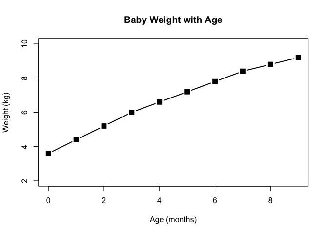
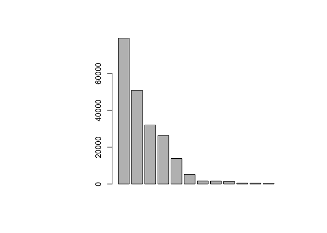
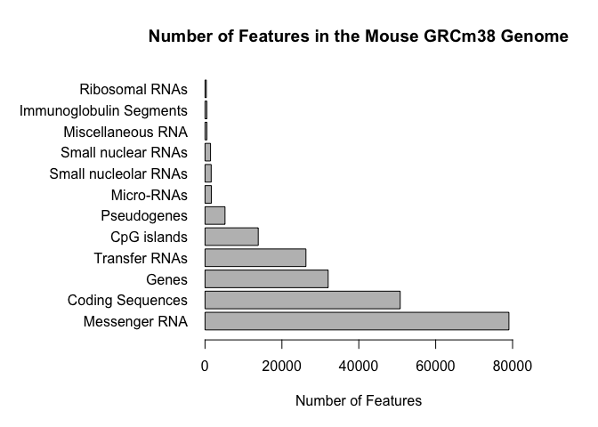
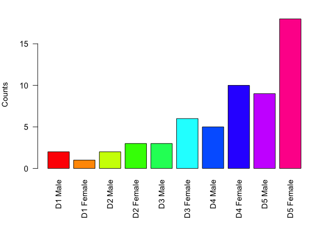
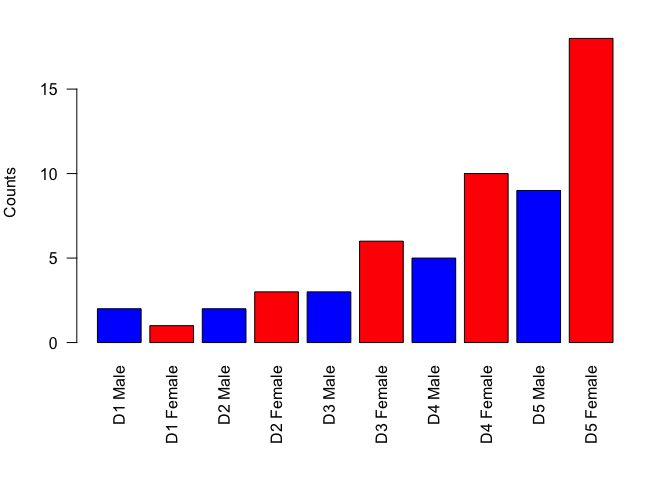
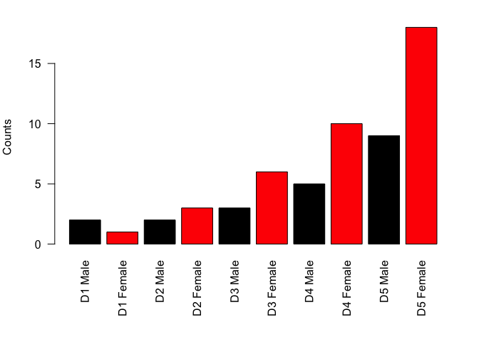
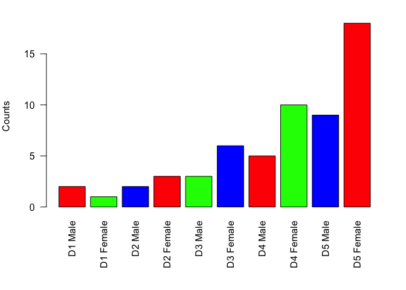

Class 5: R Graphics
================
Jaya George
April 18, 2019

``` r
# Class 5 R graphics

#2A. Line plot
weight <- read.table("bimm143_05_rstats/weight_chart.txt", header=TRUE)

plot( weight, xlab= "Age (months)", ylab= "Weight (kg)", pch=15, lwd=2, 
      cex= 1.5, ylim= c(2,10), main="Baby Weight with Age", typ="b")
```



``` r
#2B. Barplot
feat <- read.table("bimm143_05_rstats/feature_counts.txt", 
                   sep= "\t", header=TRUE)

par( mar= c(5.1,12,4.1,5) )

barplot(feat$Count)
```



``` r
barplot ( feat$Count, horiz=TRUE, 
          main="Number of Features in the Mouse GRCm38 Genome",
          las=1, names.arg = feat$Feature, xlim=c(0,80000),
          xlab= "Number of Features")
```



``` r
#Section 3

counts <- read.table("bimm143_05_rstats/male_female_counts.txt", 
                     sep = "\t", header= TRUE)
counts <- read.delim("bimm143_05_rstats/male_female_counts.txt")

par(mar= c(7,4,2,2))

barplot(counts$Count, names.arg= counts$Sample, las=2, 
        col=rainbow(nrow(counts)), ylab="Counts")
#Try different plots
barplot(counts$Count, names.arg= counts$Sample, las=2, 
        col=rainbow(10), ylab="Counts")
```



``` r
barplot(counts$Count, names.arg= counts$Sample, las=2, 
        col=c("blue", "red"), ylab="Counts")
```



``` r
barplot(counts$Count, names.arg= counts$Sample, las=2, 
        col=c(1,2), ylab="Counts")
```



``` r
barplot(counts$Count, names.arg= counts$Sample, las=2, 
        col=rainbow(3), ylab="Counts")
```


