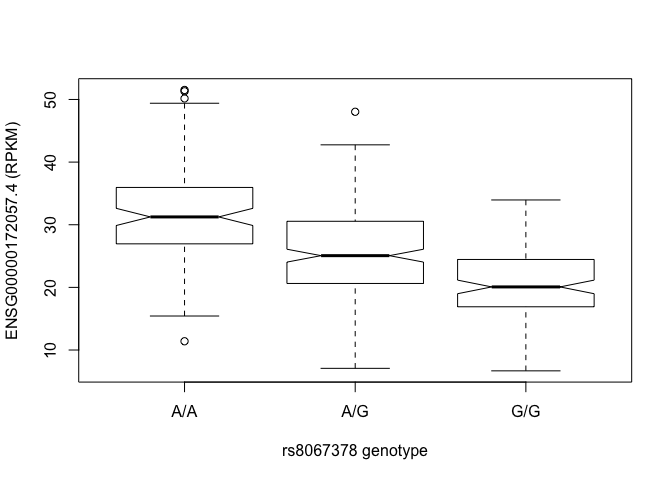

Class 13: Genome Informatics (Part 1)
================

Sample genotypes in the MXL 1000 Genomes Project data
-----------------------------------------------------

Here we focuse on the Mexican Ancestry in Los Angeles, California (MXL) population.

What proportion of the Mexican Ancestry in Los Angeles sample population (MXL) are homozygous for the asthma associated SNP (G|G)?

``` r
mxl <- read.csv("373531-SampleGenotypes-Homo_sapiens_Variation_Sample_rs8067378.csv")
head(mxl)
```

    ##   Sample..Male.Female.Unknown. Genotype..forward.strand. Population.s.
    ## 1                  NA19648 (F)                       A|A ALL, AMR, MXL
    ## 2                  NA19649 (M)                       G|G ALL, AMR, MXL
    ## 3                  NA19651 (F)                       A|A ALL, AMR, MXL
    ## 4                  NA19652 (M)                       G|G ALL, AMR, MXL
    ## 5                  NA19654 (F)                       G|G ALL, AMR, MXL
    ## 6                  NA19655 (M)                       A|G ALL, AMR, MXL
    ##   Father Mother
    ## 1      -      -
    ## 2      -      -
    ## 3      -      -
    ## 4      -      -
    ## 5      -      -
    ## 6      -      -

How many of each genotype are there?

``` r
table(mxl$Genotype..forward.strand.)
```

    ## 
    ## A|A A|G G|A G|G 
    ##  22  21  12   9

Proportion or percent of total for each genotype?

``` r
(table(mxl$Genotype..forward.strand.) / nrow(mxl)) *100
```

    ## 
    ##     A|A     A|G     G|A     G|G 
    ## 34.3750 32.8125 18.7500 14.0625

Quality scores in FASTQ files
-----------------------------

The fourth line of a FASTQ sequence format file encodes the quality score that tells us how good the sequence at a given position is (ie. how likely is it to be correct based on the instrument)

``` r
library(seqinr)
library(gtools)
phred <- asc( s2c("DDDDCDEDCDDDDBBDDDCC@") ) - 33
phred
```

    ##  D  D  D  D  C  D  E  D  C  D  D  D  D  B  B  D  D  D  C  C  @ 
    ## 35 35 35 35 34 35 36 35 34 35 35 35 35 33 33 35 35 35 34 34 31

``` r
prob <- 10**(-phred/10)
prob
```

    ##            D            D            D            D            C 
    ## 0.0003162278 0.0003162278 0.0003162278 0.0003162278 0.0003981072 
    ##            D            E            D            C            D 
    ## 0.0003162278 0.0002511886 0.0003162278 0.0003981072 0.0003162278 
    ##            D            D            D            B            B 
    ## 0.0003162278 0.0003162278 0.0003162278 0.0005011872 0.0005011872 
    ##            D            D            D            C            C 
    ## 0.0003162278 0.0003162278 0.0003162278 0.0003981072 0.0003981072 
    ##            @ 
    ## 0.0007943282

Population Scale Analysis
-------------------------

Read RNA-Seq count data with genotype information results table

``` r
expr <- read.table("rs8067378_ENSG00000172057.6.txt")
head(expr)
```

    ##    sample geno      exp
    ## 1 HG00367  A/G 28.96038
    ## 2 NA20768  A/G 20.24449
    ## 3 HG00361  A/A 31.32628
    ## 4 HG00135  A/A 34.11169
    ## 5 NA18870  G/G 18.25141
    ## 6 NA11993  A/A 32.89721

``` r
summary(expr)
```

    ##      sample     geno          exp        
    ##  HG00096:  1   A/A:108   Min.   : 6.675  
    ##  HG00097:  1   A/G:233   1st Qu.:20.004  
    ##  HG00099:  1   G/G:121   Median :25.116  
    ##  HG00100:  1             Mean   :25.640  
    ##  HG00101:  1             3rd Qu.:30.779  
    ##  HG00102:  1             Max.   :51.518  
    ##  (Other):456

``` r
inds <- expr$geno == "G/G"
summary(expr[inds,"exp"])
```

    ##    Min. 1st Qu.  Median    Mean 3rd Qu.    Max. 
    ##   6.675  16.903  20.074  20.594  24.457  33.956

``` r
inds <- expr$geno == "A/G"
summary(expr[inds,"exp"])
```

    ##    Min. 1st Qu.  Median    Mean 3rd Qu.    Max. 
    ##   7.075  20.626  25.065  25.397  30.552  48.034

``` r
inds <- expr$geno == "A/A"
summary(expr[inds,"exp"])
```

    ##    Min. 1st Qu.  Median    Mean 3rd Qu.    Max. 
    ##   11.40   27.02   31.25   31.82   35.92   51.52

``` r
boxplot(exp ~ geno , data=expr)
```


``` r
p <- boxplot(exp~geno, data=expr, xlab="rs8067378 genotype", ylab="ENSG00000172057.4 (RPKM)", notch=T)
```



``` r
p
```

    ## $stats
    ##          [,1]     [,2]     [,3]
    ## [1,] 15.42908  7.07505  6.67482
    ## [2,] 26.95022 20.62572 16.90256
    ## [3,] 31.24847 25.06486 20.07363
    ## [4,] 35.95503 30.55183 24.45672
    ## [5,] 49.39612 42.75662 33.95602
    ## 
    ## $n
    ## [1] 108 233 121
    ## 
    ## $conf
    ##          [,1]     [,2]     [,3]
    ## [1,] 29.87942 24.03742 18.98858
    ## [2,] 32.61753 26.09230 21.15868
    ## 
    ## $out
    ## [1] 51.51787 50.16704 51.30170 11.39643 48.03410
    ## 
    ## $group
    ## [1] 1 1 1 1 2
    ## 
    ## $names
    ## [1] "A/A" "A/G" "G/G"
